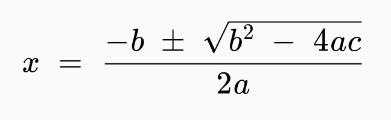
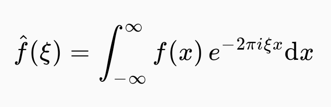

# Flutter Math

[](https://travis-ci.com/znjameswu/flutter_math) [](https://codecov.io/gh/znjameswu/flutter_math) [](https://pub.dev/packages/flutter_math)

Math equation rendering in pure Dart & Flutter. 


This project aims to achieve maximum compatibility and fidelity with regard to the [KaTeX](https://github.com/KaTeX/KaTeX) project, while maintaining the performance advantage of Dart and Flutter. A furthur [UnicodeMath](https://www.unicode.org/notes/tn28/UTN28-PlainTextMath-v3.1.pdf)-style equation editing support will be experimented in the future.


The TeX parser is a completely rewritten Dart port of the KaTeX parser, with almost full features. There are only a few differences. List of some unsupported features can be found [here](doc/unsupported.md).

## [Online Demo](https://znjameswu.github.io/flutter_math_demo/)

## Rendering Samples

`x = \frac{-b \pm \sqrt{b^2 - 4ac}}{2a}`



`i\hbar\frac{\partial}{\partial t}\Psi(\vec x,t) = -\frac{\hbar}{2m}\nabla^2\Psi(\vec x,t)+ V(\vec x)\Psi(\vec x,t)`


`\hat f(\xi) = \int_{-\infty}^\infty f(x)e^{- 2\pi i \xi x}\mathrm{d}x`




## How to use

Add `flutter_math` to your `pubspec.yaml` dependencies

From v0.1.7, this plugin no longer require extra font declarations in `pubspec.yaml`. 

### Mobile
Currently only Android platform has been tested. If you encounter any issues with iOS, please file them.

### Web
Web support is added in v0.1.6. It is tested for DomCanvas backend. In general it should behave largely the same with mobile. It is expected to break with CanvasKit backend. Check out the [Online Demo](https://znjameswu.github.io/flutter_math_demo/)

## API usage
Currently the usage is straightforward. Just `FlutterMath.fromTexString(r'\frac a b')`. There is also optional arguments of `Options` and `Settings`, which correspond to Options and Settings in KaTeX and support a subset of their features.

Display-style equations:
```dart
FlutterMath.fromTexString(r'\frac a b', options: Options.displayOptions)
```

In-line equations
```dart
FlutterMath.fromTexString(r'\frac a b', options: Options.textOptions)
```

You can also resize the output by providing `baseSizeMultiplier` parameter. (This parameter will also affect the size of absolute unit used in the equation. You can obtain the approximate font size for normal-sized letters by `Options.fontSize`.)

```dart
FlutterMath.fromTexString(
  r'\frac a b', 
  options: Options(
    style: MathStyle.display, 
    baseSizeMultiplier: 1.5,
  ),
)
```

If you would like to display custom styled error message or handle them differently, you should use `onErrorFallback` parameter

```dart
FlutterMath.fromTexString(
  r'\garbled $tring', 
  onErrorFallback: (errMsg) => Text(errMsg), // You can also invoke your handler here
)
```

## Credits
This project is made possible thanks to the inspirations and resources from [the KaTeX Project](https://katex.org/), [MathJax](www.mathjax.org), and [Zefyr](https://github.com/memspace/zefyr).

## Goals
- [x] : TeX math parsing (See [design doc](doc/design.md))
- [x] : AST rendering in flutter
- [ ] : TeX output
- [ ] : [UnicodeMath](https://www.unicode.org/notes/tn28/UTN28-PlainTextMath-v3.1.pdf)-style editing
- [ ] : UnicodeMath parsing and encoding
- [ ] : Breakable equations
- [ ] : MathML parsing and encoding
